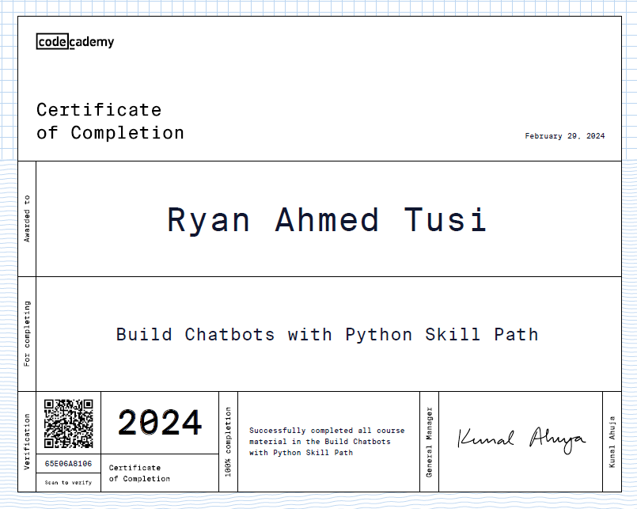

# Chatbots 🤖

Welcome to the Chatbots Repository! These chatbots were developed as part of the "Build a Chatbot with Python Skill Path" course from Codecademy, covering three types of chatbots: rule-based chatbot, retrieval-based chatbot, and generative chatbot.

## Rule-based Chatbot

📋 Description: This chatbot operates on predefined rules and responses, making it suitable for simple and deterministic conversations.

💻 Technologies: Python, Regular Expressions

🔍 Concepts:
- Rule-based systems
- Text Preprocessing
- Pattern matching
- Response generation
- Intent
- Utterance
- Entities

## Retrieval-based Chatbot

📋 Description: The retrieval-based chatbot retrieves responses from a predefined set of responses based on input similarity, making it more flexible than rule-based chatbots.

💻 Technologies: Python, NLTK, scikit-learn, TF-IDF, Cosine Similarity.

🔍 Concepts:
- Natural Language Processing (NLP)
- TF-IDF Vectorization
- Cosine Similarity
- Response selection algorithms
- Word Embeddings
- Intent Classification
- Entity Recognition

## Generative Chatbot

📋 Description: The generative chatbot generates responses based on deep learning models, allowing for more dynamic and context-aware conversations.

💻 Technologies: Python, TensorFlow, seq2seq Models, Natural Language Processing, Keras

🔍 Concepts:
- Deep Learning
- LSTM 
- Language-topic modelling
- Sequence-to-Sequence (seq2seq) Models
- One hot vectors
- Natural Language Generation (NLG)
- Contextual understanding
- Generative AI

## How to Use This Repository

Each type of chatbot is organized into its respective directory, containing code files, models, and documentation. You can navigate to each chatbot's directory to explore its implementation, run demos, and understand its functionality.

Feel free to experiment, learn, and contribute to this repository. Your feedback and suggestions are highly appreciated!

## Certification

I have successfully completed the "Build a Chatbot with Python Skill Path" course from Codecademy and earned certifications for each type of chatbot showcased in this repository.

## Additional Resources

You may find the following resources helpful for understanding chatbot development and AI techniques:

- [Codecademy - Build a Chatbot with Python Skill Path](https://www.codecademy.com/learn/paths/build-chatbots-with-python)
- [NLTK Documentation](https://www.nltk.org/)
- [scikit-learn Documentation](https://scikit-learn.org/stable/)
- [TensorFlow Documentation](https://www.tensorflow.org/)
